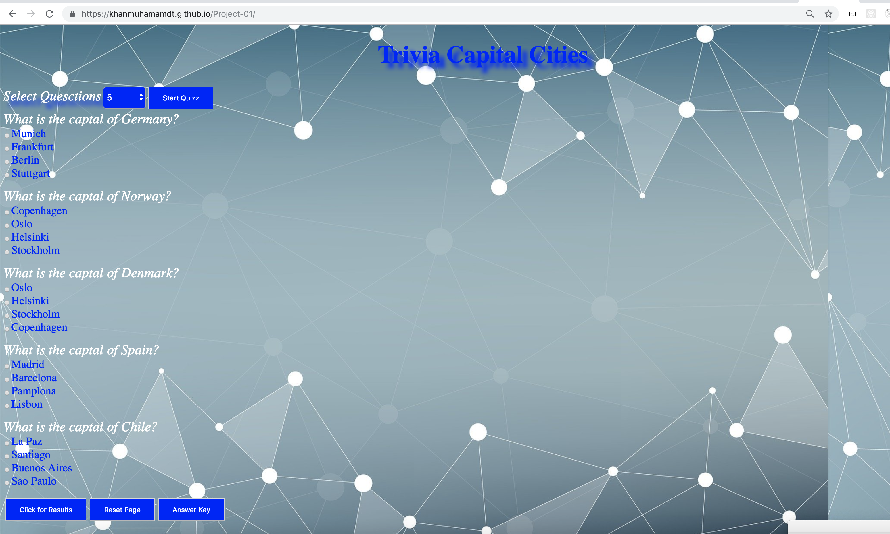

##  Trivia Capital Cities Webapplication V-1 
##  Web Application URL 
* [Project Link](https://khanmuhamamdt.github.io/Project-01/)

##  Layout

##  Scope.
     * Web aplication is designed to test the knowledge of capital cities around the world.
     * Version -1 has set of pre defined questions 
     * Dynamic functionality will be added in the second version either by API call or fetching the questions from the database
## Work Breakdown Structure
Day         |   TASK          |    Effort
------------| -------------  | -------------
December 2nd| Analysis       |    2 hours
            | Layout         |    1 hour
            |Logic to generate question | 5 hour
December 3rd|Logic to calculate Answer | 4 hour
            |Refactoring, Code Formatting | 4 hour
December 4th |Refactoring, Testing  | 4 hour
             | DOM Logic |  4 hours
December 5th | Replacing Alert Messages|  3 hours
             | Refactoring|  3 hours
             | Documenation , Alignment| 3 hours
December 6th | Documenation , Alignment| 4 hours
## Languages 
     * HTML,Java Script,CSS are used to implement the functionality.
##  Functionality . 
     * User will select the questions from the drop down list and then click on the Start Quizz button
     * Application will display the questiion based on the  drop down selection
     * Select the answers and click on Results button
        * Alert message will display the results 
        * Minimum 70 % score is required for the success 
        * After clicking on OK buuton the following will be used for the feedback.
            * Green text color will represend the correct options 
            * Red tex color will represent the  wrong questions 
            * Yellow color will represnt the questions which are not attempted 
        * Answer Key button
            * will dispaly the answer key in the alert message 
        *  Reset Button 
            * will load the load the we application again.     
##   Technical Design
      * List of Functions
        * createOptionButton( arg1,arg2)
          * accept two arguments Radio button and city name
        * createDivLabel (arg1,arg2)
          * accept element and option
        *  createQuestions()
          * create the list of question based on the JSON object
        * calculateResult()
          * Calculate the results
          * As
          * Test line
          
 
